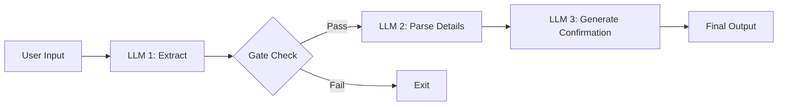
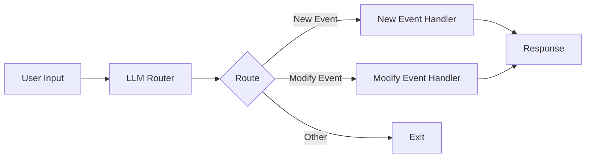
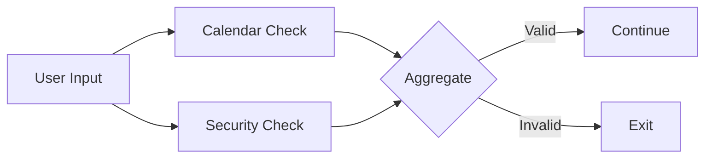
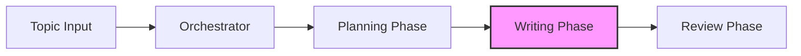
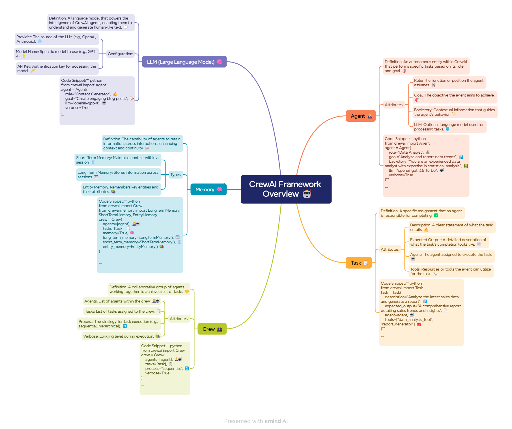
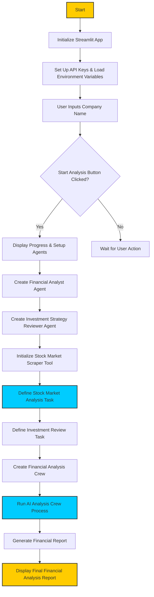
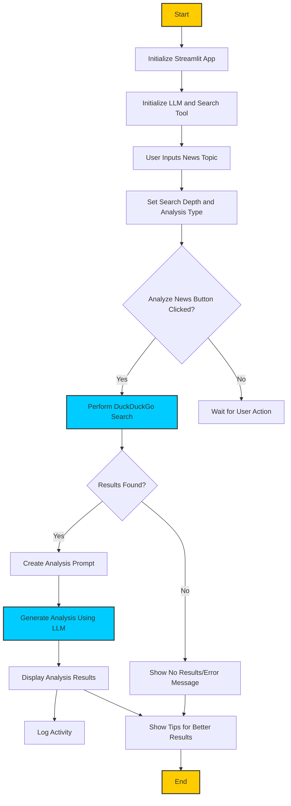
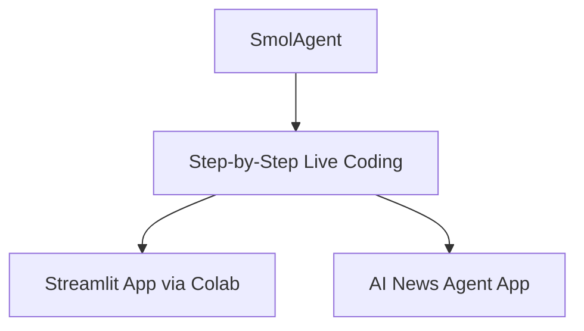

# 🧠 AI Agent Workshops

***13 Feb 2025, University of Wollongong, GiftCity, Gandhinagar***

---

## 📌 Table of Contents

#### **🔹Part 1: Building Blocks – The Augmented LLM**

- **Basic LLM Calls** – Sending requests and processing responses
- **Structured Output** – Formatting responses in structured formats
- **Tool Use** – Integrating external tools with the LLM
- **Retrieval** – Using memory and external sources for better responses

#### 🔹**Part 2: Workflow Patterns for AI Systems**

- **Prompt Chaining** – Structuring multi-step AI tasks
- **Routing** – Directing requests to specialized handlers
- **Parallelization** – Running multiple AI processes simultaneously

#### 🔹Part 3: Introduction to Agentic Framework (CrewAI)

- **CrewAI Framework Step by Step**
- **Agent  :** Finance Agent App

#### 🔹Part 4: Introduction to Agentic Framework(SmolAgent)

- **SmolAgent Framework Step by Step**
- **Agent** : AI News Agent App

---

## 🔄Part 2: Workflow Patterns for AI Systems

### 🏗️ Prompt Chaining

Prompt chaining **breaks down complex AI tasks** into smaller, more manageable steps. Each step **processes** and **validates** the output from the previous step, improving **control and reliability**.

#### 📅 Calendar Assistant Example

**📝 Step Breakdown:**

| **Step**                             | **Description**                                                                                                                                   |
| ------------------------------------------ | ------------------------------------------------------------------------------------------------------------------------------------------------------- |
| **✅ Step 1: Extract & Validate**    | - Detects if input is a valid**calendar request**   - Assigns a **confidence score**  - Filters out **irrelevant requests** |
| **✅ Step 2: Parse Details**         | - Extracts structured information (**date, time, participants**)  - Converts **natural language** into a structured format             |
| **✅ Step 3: Generate Confirmation** | - Creates a**user-friendly response**  - Generates calendar links if necessary                                                               |

---

### 🔀 Routing

Routing is a pattern that directs different types of requests to specialized **handlers**, allowing for **clean separation of concerns** and **optimized processing**.

#### 📅 Calendar Assistant Example

**📝 Step Breakdown:**

| **Component**               | **Description**                                                                                                 |
| --------------------------------- | --------------------------------------------------------------------------------------------------------------------- |
| **✅ Router**               | - Classifies requests into**new event** or **modification**  - Provides **confidence scoring** |
| **✅ Specialized Handlers** | -**New Event Handler:** Creates calendar events - **Modify Event Handler:** Updates existing events  |

---

### ⚡ Parallelization

Parallelization improves **efficiency** by running multiple LLM calls **simultaneously** to analyze different aspects of a request in parallel.

#### 📅 Calendar Assistant Example

**📝 Step Breakdown:**

| **Component**            | **Description**                                                                                                      |
| ------------------------------ | -------------------------------------------------------------------------------------------------------------------------- |
| **✅ Parallel Checks**   | **- Calendar Validation:** Ensures a valid request  **- Security Check** : Screens for prompt injection |
| **✅ Aggregation Layer** | - Merges results from parallel checks - Makes the**final validation decision**                                  |

---

### 🎭 Orchestrator-Workers

The **orchestrator-workers** pattern uses a **central LLM** to dynamically **analyze, coordinate, and synthesize** responses from specialized workers. This is useful for tasks requiring structured content generation.

#### 📝 Blog Writing Example

**📝 Step Breakdown:**

| 🛠️**Orchestrator**                                     | 📝**Planning Phase**                                 | ✍️**Writing Phase**                           | 🔍**Review Phase**                        |
| -------------------------------------------------------------- | ---------------------------------------------------------- | ----------------------------------------------------- | ----------------------------------------------- |
| 🔎 Analyzes the**blog topic** and **requirements** | 📌 Breaks content into**sections**                   | 🏗️ Assigns sections to**specialized writers** | ✅ Evaluates**content flow and cohesion** |
| 🏗️ Generates a**structured content plan**              | 📏 Defines**word count** and **writing style** | 🔗 Maintains**context and consistency**         | ✨ Suggests**improvements**               |
| 🔄 Oversees**content cohesion**                          | -                                                          | -                                                     | 🏆 Produces a**polished final version**   |

---

## 🔄Part 3: Introduction to Agentic Framework 🤖

This section introduces additional architectures for building AI agents, providing a structured overview of their workflows and modular designs.

##### CrewAIAgent

**CrewAI** follows a modular, step-by-step approach that includes:

**Example:** **Finance Agent App**

> **Workflow**

## 🔄Part 4: Introduction to Agentic Framework(SmolAgent)

##### **SmalAgent**

**SmolAgent** provides a live coding guide for building lightweight agents. Key highlights include:

- **Streamlit App:** Running using Colab as the backend server
- **AI News Agent App**

> **Workflow**

> **Running live in Colab**

---

## 🤝 Contributing

Contributions are welcome! To get started:

1. **Fork** the repository
2. **Create a branch** (`feature-new-pattern`)
3. **Commit your changes**
4. **Push to GitHub** and **open a PR**

For detailed guidelines, check [CONTRIBUTING.md](CONTRIBUTING.md).

---

## 📜 License

This project is licensed under the **MIT License** – see [LICENSE](LICENSE) for details.

---

## 📬 Contact

For questions or collaborations, feel free to reach out:

📧 **Email:** ashishpatel.ce.2011@gmail.com

---

_🎯 Happy Coding! 🚀_
